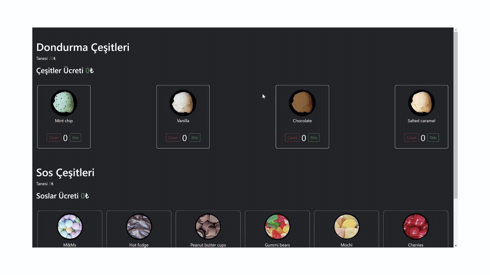

# Kütüphaneler

- json-server
- bootstrap
- axios@^0.27.2
- @testing-library/user-event@14.0

# Selectors - Seçiciler
- Test içerisinde jsx elementlerini çağırmaya yarayan metodlardır
- screen nesnesi aracılığıyla kullanılır
- https://testing-library.com/docs/queries/byrole
# HTML element rolleri
- https://developer.mozilla.org/en-US/docs/Web/Accessibility/ARIA/Roles

- Her html elementinin kendine ait rolleri vardır bu roller bazılarında etiket ismi ile aynı bazılarında ise farklı olabilir

# Matchers - Kontrolcüler
- expect komutu ile birlikte kullanılan bir  elementin üzerindeki beklentimizi konrol eden methodlardır. (rengi kırmızıdır | input tiklenmiştir | buton aktiftir | yazı içeriği sudur | fonksiyon çagrılmıstır | dizinin uzunluğu 5 tir vb.)
- element kontrolleri
- https://github.com/testing-library/jest-dom

- diğer kontroller
- https://jestjs.io/docs/using-matchers

# Test Geliştirme Süreçleri

## TDD (Test driven Development)
- Önce testler yazılır sonra işlevler yazılır.
- red to green
- Artısı ,testler bir yük gelmez. Geliştirme sürecinin bir parçası oluyor. Testleri yazarken dinamik yapının algoritmasını oluşturduğumuz için işlevi daha hızlı kodlarız

## BDD (Behaviour Driven Development)

- Önce özellik / işlev geliştirilir daha sonra tesleri yazılır

- 100% test covarage

# FireEvent
- react testing lib içerisinde gelen olay tetikleme metodu
- gercek kullanıcıdan uzak tepkiler kullandıgı için günümüzde UserEvent e bıraktık
- tetiklenen olaylar gerçek bir insanın tepkisinden çok daha hızlı bir şekilde gerceklestigi için testlerde tutarsızlıklara ve beklenmedik yollara neden olabiliyor

# UserEvent
- fireEvent in gelismis versiyonu
- tetiklediğimiz olaylar fireevent gibi doğrudan tetiklenmsei yerine gerçek bir kullanıcıyı simüle ederek belirli bir gecikmenin ardından tetiklenir
- kullanılması için kütüphanenin projeye kurulması gerekir
- async calıstıgı için async await kullanılır

# Özellikler
- Card Bileşeni: Miktar, başlık ve fotoğraf gibi prop'ların ekrana doğru şekilde yansıdığını test ettik. Ayrıca, butonların doğru şekilde çalıştığını ve fonksiyonların beklenen parametrelerle çağrıldığını doğruladık.

- Scoops Bileşeni: API'den alınan dondurma çeşitlerinin ekranda doğru şekilde görüntülendiğini ve sepete ekleme/çıkarma işlemlerinin toplam fiyat üzerindeki etkilerini test ettik.

- Toppings Bileşeni: Sosların eklenmesi ve çıkarılmasının toplam fiyata etkisini inceledik, checkbox etkileşimlerini test ettik.

- Form Bileşeni: Koşul onaylama ve buton aktifliği durumlarını test ettik. Butonun hover durumunda bildirim gösterip göstermediğini de kontrol ettik.

# GIF

